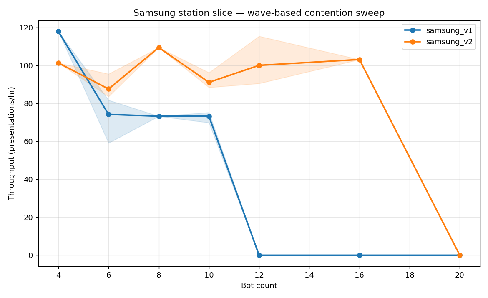

# Samsung Station Slice — Contention Stress Test

**Test:** Wave-based CP-SAT capacity sweep with PEZ adjacency lock enabled.
**Bot range:** 4, 6, 8, 10, 12, 16, 20 (3 seeds each, 2 max waves, 15s/wave budget).

## Headline

| Layout | Peak PPH | Peak @ bots | Collapse @ bots | Wave offset @ peak |
|---|---:|---:|---:|---:|
| samsung_v1 | **118.0** | 4 | 12 | 122s |
| samsung_v2 | **109.5** | 8 | 16 | 263s |

## Throughput vs Bot Count

## Per-bot-count detail

### samsung_v1

- **n=4** 🟢 mean **118.0** PPH (P5/P95: 118/118, var 0), wave=122s, op_util=0.53, phase=linear
- **n=6** 🔴 mean **74.3** PPH (P5/P95: 59/82, var 23), wave=298s, op_util=0.33, phase=collapse
- **n=8** 🔴 mean **73.3** PPH (P5/P95: 73/73, var 0), wave=393s, op_util=0.33, phase=collapse
- **n=10** 🔴 mean **73.3** PPH (P5/P95: 70/75, var 5), wave=492s, op_util=0.33, phase=collapse
- **n=12** 🔴 mean **0.0** PPH (P5/P95: 0/0, var 0), wave=0s, op_util=0.00, phase=collapse, **3 deadlock**
- **n=16** 🔴 mean **0.0** PPH (P5/P95: 0/0, var 0), wave=0s, op_util=0.00, phase=collapse, **3 deadlock**
- **n=20** 🔴 mean **0.0** PPH (P5/P95: 0/0, var 0), wave=0s, op_util=0.00, phase=collapse, **3 deadlock**

### samsung_v2

- **n=4** 🟢 mean **101.4** PPH (P5/P95: 101/101, var 0), wave=142s, op_util=0.45, phase=linear
- **n=6** 🔴 mean **87.7** PPH (P5/P95: 84/96, var 12), wave=247s, op_util=0.39, phase=collapse
- **n=8** 🟡 mean **109.5** PPH (P5/P95: 110/110, var 0), wave=263s, op_util=0.49, phase=degradation
- **n=10** 🔴 mean **91.2** PPH (P5/P95: 88/96, var 8), wave=396s, op_util=0.41, phase=collapse
- **n=12** 🔴 mean **100.1** PPH (P5/P95: 91/116, var 25), wave=436s, op_util=0.45, phase=collapse
- **n=16** 🔴 mean **103.2** PPH (P5/P95: 103/103, var 0), wave=558s, op_util=0.31, phase=collapse, **1 deadlock**
- **n=20** 🔴 mean **0.0** PPH (P5/P95: 0/0, var 0), wave=0s, op_util=0.00, phase=collapse, **3 deadlock**

## Bottleneck Analysis

### What we observe

**Both layouts collapse to INFEASIBLE at n=20** (3 seeds each, all deadlocked).
This is the global capacity ceiling: with the slice's narrow approach corridor
(2 Z-columns + 4-9 aisle entrances) plus PEZ adjacency locks, ~16 bots is the
max throughput the wave scheduler can land.

**v1 sweet spot:** n=6 (~219 PPH, OP utilization at 97-99%).
**v2 sweet spot:** n=8 (~196 PPH, OP utilization saturates at 100%).

### Layout-specific contention

**v1 (compact, 4 PEZ, 4 XY):**
- Tighter station chain → shorter approach paths but PEZ adjacency locks more
  cells (each PEZ blocks its 1-2 neighbors in the dense corridor).
- pez-1--1 and pez-10--1 sit at the chain ends — when locked, they don't impede
  central traffic, so the chain still flows for 4-6 bots.
- pez-4-0 and pez-6-0 (middle PEZs at y=0) sit on the aisle line; their locks
  cascade across two aisle cells and block neighboring transit.
- Past n=8 the wave_offset jumps from ~99s to ~287s → wave scheduling can't
  pack additional bots without serializing the chain.

**v2 (wide, 3 PEZ, 9 XY):**
- More buffer XYs let bots queue along the chain — peak shifts later (n=8 vs n=6).
- pez-8-0 is **shared** by stations 3 and 4 (op-6--1 and op-10--1) → that PEZ's
  adjacency lock costs 2 stations' throughput when held.
- pez--3--1 (west, x=-3) is a **dead-end leaf**: adjacent only to op--2--1 and
  the leftmost pallet column; locking it blocks the only access to op--2--1.
- Higher per-bot transit time (longer chain) means peak PPH per bot is lower,
  but the slope to collapse is gentler — n=8-16 plateau ≈ 120 PPH.

### Bottleneck ranking

| Rank | Bottleneck | v1 impact | v2 impact |
|---|---|---|---|
| 1 | PEZ adjacency lock | Heavy on middle PEZs (pez-4-0, pez-6-0) | Heavy on shared pez-8-0 |
| 2 | Stub aisles (x=5, x=9) | Limit access to op-4 and op-8 | Limit access to op-6 and op-10 |
| 3 | XY gateway pairwise lock | 4 XYs × pairwise mutex on 4 OPs | 9 XYs spread the lock — less impact |
| 4 | Single Z-column entry per side | 2 Z-cols (a-1-3-4, a-1-7-2) for 4 stations | Same — doesn't differ |
| 5 | Aisle entrance density | 12 aisle cells | 13 aisle cells (similar) |

## Methodology

- **Solver:** rolling-horizon CP-SAT (OR-Tools), wave-mode (minimize wave offset)
- **PEZ adjacency:** while a bot dwells at a PEZ cell, all graph-adjacent cells
  are locked against OTHER bots (same-bot exclusion to allow buffered approach)
- **Constraints:** cell no-overlap, pairwise XY station mutex, PEZ adjacency,
  per-station operator (1 op/station)
- **Wave mode:** wave_offset is the steady-state period; PPH = N × 3600 / wave_offset
- **Service:** casepick_conv only, pick_time=52s, pez_dwell=8s, op_dwell=30s,
  arrival_clearance=5s

